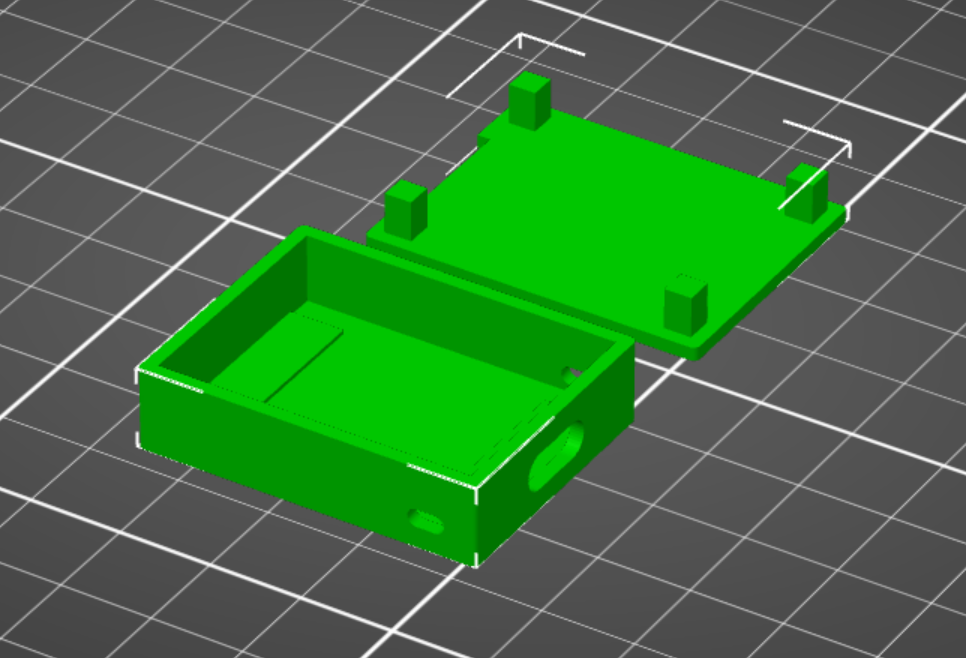

# Power Outage Detector

## Overview

Over the holidays, I thought that it would be a great idea to have a power outage detection device for our home in New England.   A quick duckduckgo search discovered  [@fabytm's](https://github.com/fabytm) excellent [Raspberry Pi implementation](https://github.com/fabytm/Outage-Detector).
After a bit of toying with it, I decided that a more light-weight version of Butean's idea might be simpler on a cheap ESP32 or ESP8266 MCU. It will also allow others with less time, less money, or possibly less technical skills to build a power detection device.

## Purpose

There are two outage scenarios that I wanted to capture:

1. First, I wanted to use Adafruit's feed notification system to notify me when it had not received an HTTP response from my device within a specified period of time.  Adafruit IO allows free accounts to send notifications if no updates have been posted in 10 minutes, 30 minutes, 1 hour, or 1 day.  This 'online' feed feature is really nice.  For the free Adafruit IO accounts, it's email only but for our purposes, this is quite sufficient.

2. The code, all 75 lines of it, also tracks the epoch time.    When power resumes, it calculates how much time has passed since the last recorded time and will post to IFTTT this delta if it exceeds a value that you set in `config.py`. 

For me, I set the Adafruit notification interval to 10 minutes.  In `config.py`, I also set the Adafruit posting interval to 30 seconds and the outage interval to 30 minutes.   I also have this feed emailing my gmail account which has a rule that if the sender is notify@io.adafruit.com, it forwards the email to my AT&T SMTP-to-SMS gateway - 3015551212@txt.att.net and I get an SMS alert.

## Requirements

You'll need the following 5 components to build this device:

1. An Expressif ESP MCU - I've chosen [the Lolin/Wemos ESP32C3 board](https://www.wemos.cc/en/latest/c3/c3_mini.html) for ~ $4.  An ESP8266 works equally well.

2. Micropython - you can download it for the above board [here](https://micropython.org/download/LOLIN_C3_MINI/).  You'll need `esptool` and `ampy` tools to flash micropython and upload 
your python scripts.  Use your favorite serial connectivity tool (putty.exe, screen, etc.).

3. The `detect.py` and `config-sample.py` micropython files. Rename `config-sample.py` to `config.py` to incorporate your Wifi, Adafruit and IFTTT credentials.

4. Free accounts made on both Adafruit and IFTTT.  Creating this accounts is simple - just to go these sites directly and sign up. You'll need to create a feed and set up the notification for this feed on Adafruit.  On IFTTT, use a webhook using the feed name that you specified in Adafruit.  

5. A small case to enclose the MCU.  I've included both the .scad and .stl version of a small case that will house the ESP chip.  You can modify it as you look to fit the board of your choosing.  Use scad to make these changes.

Comments/suggestions/criticism are welcomed.  Keep in mind, I built this repo and code in less than 90 minutes and I'm sure it could be improved.  But it works great for what I need.

